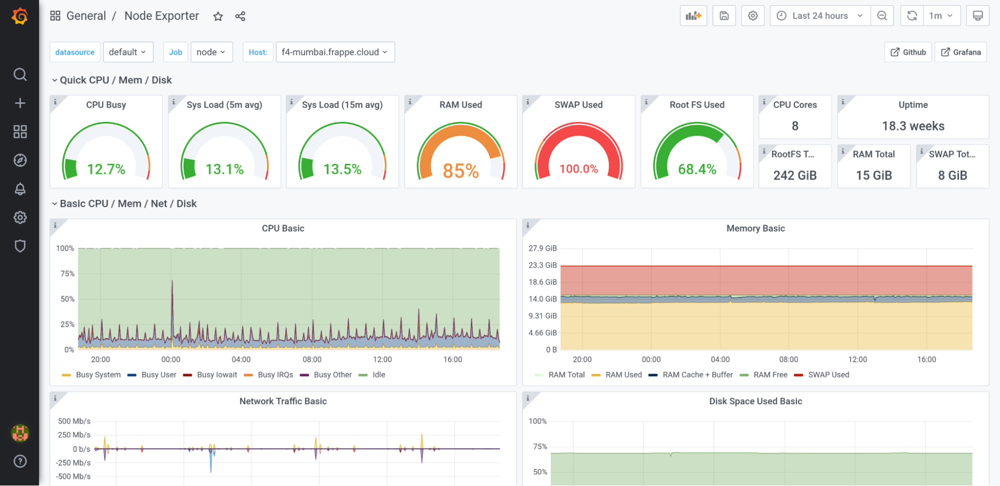
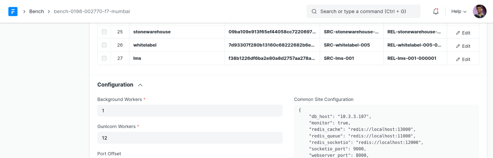
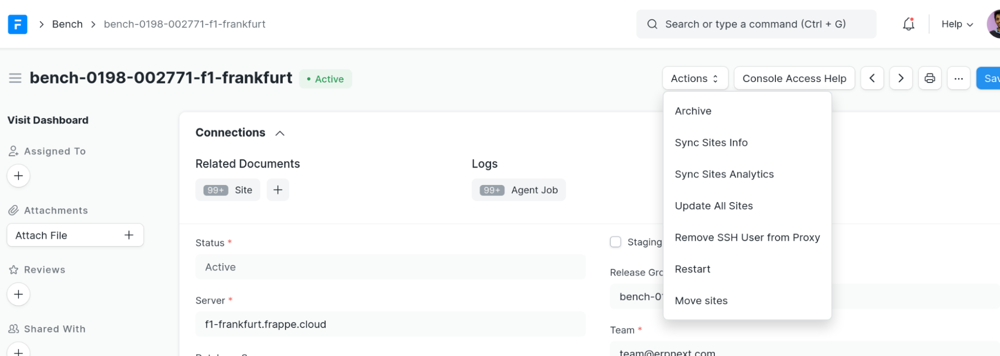

Graffana dashboard at monitor.frappe.cloud is used for monitoring general & specific things on a server without having to ssh into it.

  

### High Load Average

Generally means a lot of processes are waiting to be run. Ideally, this number should be no greater than the number of cores on the machine.

Can happen due to multiple reasons, not limited to:

* Too many backup jobs running. Backup jobs at the moment are triggered with mysqldump command on app server. These can cause slowdowns because of disk bottlenecks.
* Too few workers available. If there are say too few gunicorn workers to handle load for a particular bench, more requests will stay in waiting. This can be handled by assinging workers in the corresponding Bench document.

  

### High Ram Usage

We have `earlyoom` installed on all servers, which should kill processes that abruptly start using too much RAM. Some gunicorn workers get killed this way. If ram usage is too high, it’s a sign that we shouldn’t create new benches here. More benches would mean more workers with more RAM usage of their own.

* Bench Groups can be moved by going to Release Group doc, then Actions -> Change Server

  

* Then after bench group is deployed, go to Bench doc and then, Actions -> Move Sites

  

### Disk Almost Full

* Can increase disk size for AWS servers via telegram bot (50GB). If you need to increase more, from the system console, call the whitelisted method.

### Alerts

We have alerts set up for different criteria. Eg: Sites Down. These alerts are sent to our Telegram group: **Frappe Cloud Alerts**. Members of the group are advised to monitor the group for alerts posted by **Frappe Cloud Alert Bot**.

Categories of alerts exist:

* **Critical** alerts should be looked into ASAP
* **Warning** alerts are problems which may cause critical issues going forward
