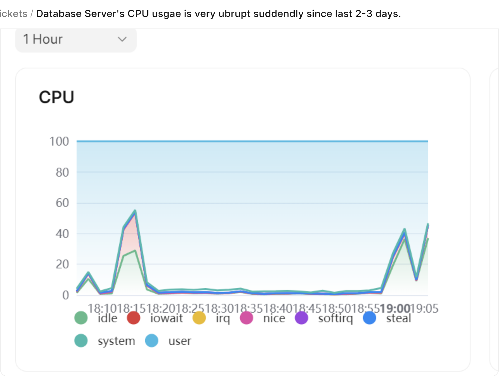
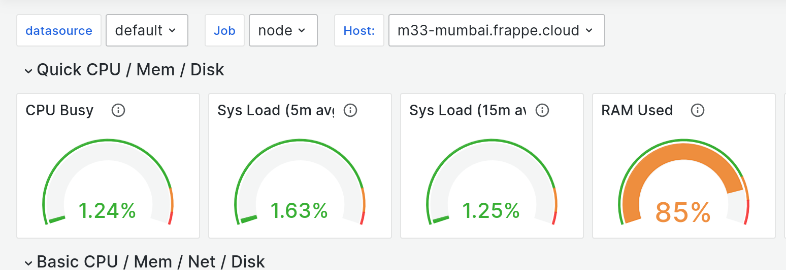
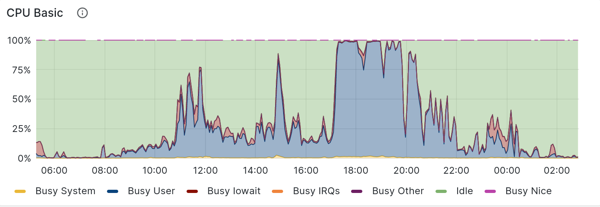
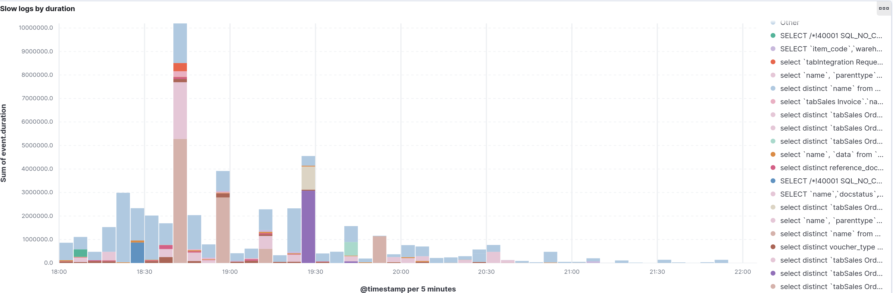
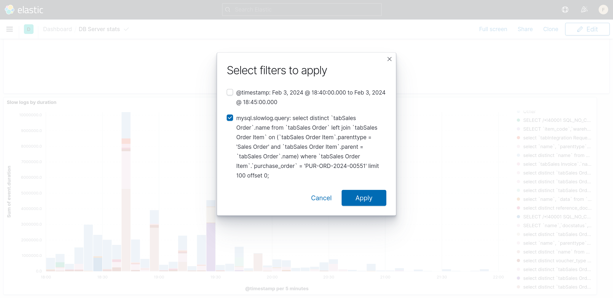
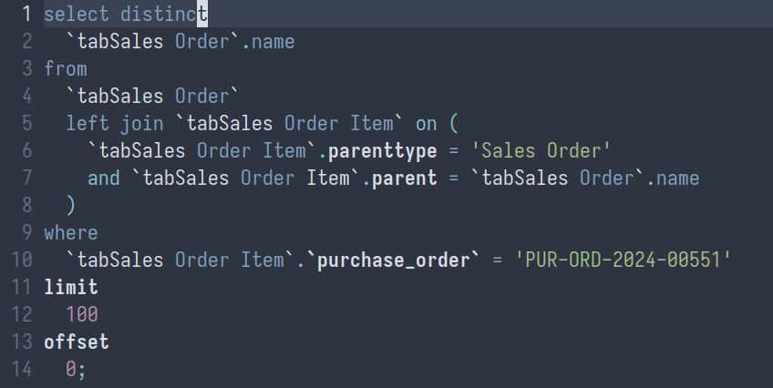

Setting up new Server (AWS)
---------------------------

#### Create Virtual Machine document for Proxy Server


> Skip this step if Proxy for Region already exists
> 
> 

* Specify region, machine type, size and private ip accordingly


	+ Copy from pre existing VM for Database Server if unsure
	+ Private ip should follow chronological pattern for existing Database Servers for the region 
* Save the changes
* Click on Poll Pending Machine under **Actions**
* Wait till Installing is complete

#### Create Proxy Server Doc

  


* Put AWS as provider
* Put hostname as `n[x]-[region]` where x starts from 1, region is Cluster
* Link Virtual Machine doc created in previous step in Virtual Machine field
* Save the changes
* Actions -> Ping ansible unprepared; Should be successful
* Actions -> Prepare server; Wait for success
* Actions -> Ping ansible; Wait for success
* Actions -> Setup Server; Wait for success

#### Create Virtual Machine document for Database Server

* Follow the same substeps as for Proxy Server, but for Database Server now.

#### Create Database Server Doc

  


* Follow the same substeps as for Proxy Server, but for Database Server now.
* *Hostname should start with* ***m*** *instead of n*

#### Create Virtual Machine Doc for Application Server

* Follow the same substeps as for Proxy Server, but for Server now.

#### Create Server Doc

  


* Follow the same substeps as for Proxy Server, but for Server now.
* Link proxy corresponding to region in respective field
* Link database server created in previous step in respective field.
* *Hostname should start with* ***f*** *instead of n.*
* After the setup is complete, click **Add to Proxy** under Actions.

#### Once the server setup is complete

* Add the new Server to child table of public release groups.

  


* Go to linked deploys for latest successful Depoy Candidate of each release group.
* Create new Deploy record with newly created server in child table.
* Check **use for new sites** and **use for new benches** checkbox in the Server document if new sites are to be created here.

### Manual Ops after setting up AWS servers

* For Database Server, run the `database_memory_limits.yml` playbook


```
ansible-playbook -u root press/playbooks/database_memory_limits.yml -i server-name,
  

```
* For App Server, run the `server_memory_limits.yml` playbook


```
ansible-playbook -u root press/playbooks/server_memory_limits.yml -i server-name,
  

```

> The trailing comma above is required
> 
> 

Clearing binlogs on Database Server
-----------------------------------

Sometimes disk may be increasing rapidly on database server due to increase in rate of creation of binlogs due to one reason or the other. We can purge binlogs in such cases with the [PURGE BINARY LOGS](https://mariadb.com/kb/en/purge-binary-logs/) command.

1. Check number of binlogs with `ls /var/lib/mysql`
2. Open mysql console with `mysql` as root user
3. `PURGE BINARY LOGS TO 'mysql-bin.xxxx'`


> To disable binlogs on db server, add `skip-log-bin` and comment out `log-bin` in frappe.cnf
> 
> 

Resolving Disk Full on Database Server
--------------------------------------

When disk is full 100% on database server it becomes impossible to resize it as resizing also requires some free space left on disk. We can remove binlogs in such cases. These are the steps to remove binlog safely:

1. Stop mariadb `systemctl stop mysql`
2. Go to `/var/lib/mysql`
3. Remove certain binlog files as need be (`mysql-bin.00xxxx`)
4. Update `mysql-bin.index` file to remove the files you deleted from the index
5. Start mariadb: `systemctl start mysql`


> Note that we're not using PURGE BINARY LOGS as the command gets stuck when disk is full
> 
> 

Uprading an AWS instance
------------------------

In case when you have to upgrade an AWS EC2 instance, you can follow below steps:

1. Open the Server doc and click on the Virtual Machine(VM) doc linked to it.
2. In corresponding VM doc, stop the running server. `Actions -> Stop`
3. Wait a bit to check if its Stopped. You can also sync and check. `Actions -> Sync`
4. Once the VM is stopped, you can now upgrade the machine by `Actions -> Resize` and type the instance you wish to upgrade to. [Check out different instance types](https://aws.amazon.com/ec2/instance-types/).
5. Now start the server again. `Actions -> Start`
6. Keeping syncing till you see the server in Running State.

Increasing the Storage on AWS Server
------------------------------------

You can increase the storage of the AWS Server by using **Frappe Cloud Alerts Telegram Bot**. You can do this by invoking the bot in the group.   
`@frappe_cloud_bot server f29-mumbai.frappe.cloud execute increase_disk_size <size in gb>`   
The server name can be any server on AWS present in the server doctype and `increase_disk_size` can be changed to any whitelisted method on the doctype(server). An EBS instance of 50GB will be attached to the server if no size is specified.


> Note that the Volume increase can only be done once in 6 hours for a server
> 
> 

Debugging slow site; an example
-------------------------------

Often times we'll get tickets from customers asking why their site was slow at a particular time frame. I'll try to list down a bunch of things you can do in order, so that you'll be able to debug this easily. As an example, I'll investigate ticket #9429

### Check server-wide stats

You can do this by checking the **Node Exporter** dashboard on [monitor.frappe.cloud](https://monitor.frappe.cloud/). The charts in Grafana are much more feature rich than the simple ones we provide on the Servers dashboard on FC.  
  
Customer reported increase CPU usage around **6-9 PM** on **3rd of Feb**  
  
  
We can validate the same from the CPU graph in Grafana also by looking at stats for **m33-mumbai,** which is their database server. Since the spike is **blue,** it means queries were actually slow, and it took **MariaDB** a long time to compute the result for the same. This is good. As, this usually means the query can be optimized.  
  


> A **red** CPU graph on the other hand would indicate long time spent doing reading from disk. This is usually a sign that the DB server needs to be upgraded for more **Memory/RAM**
> 
> 

### Searching for slow queries

Now that we know there could be queries can be optimised. We need to look at the **Slow Queries** for the same. We can do this by looking at the **DB Server Stats** report on [**log.frappe.cloud**](http://log.frappe.cloud)   
  
  
**NOTE**: We're looking at slow queries on the server as a whole as they're a dedicated server customer. So all the queries belong to them only.  
  
You put the following filter to show reports for the server we're interested in:  
  
[agent.name](http://agent.name) : "[m33-mumbai.frappe.cloud](http://m33-mumbai.frappe.cloud)"  
  
The most interesting chart in this dashboard is the **Slow queries by duration** chart:  
  
  
  
This is because the chart factors in both the number of queries and the time it took for each. The queries at the **bottom** of the legend on the right tells you what the slowest queries are. You can click on the bar corresponding to the same to view the query and filter for the same in all other charts.  
  
  
The most interesting queries here are of type:  
  
with varying filter on **purchase\_order**

### Resolution

You can ask a developer for their opinion at this point. We also can report this finding to our customer and expect them to add a **DB** **INDEX** for the same field with **bench add-database-index** command (provided they have bench access)


> Note that not all slow sites imply slow queries, but since I've seen a spike in tickets asking about the same, I've written this doc so at least preliminary investigation can be a bit better.
> 
> 

