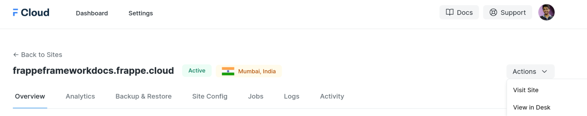
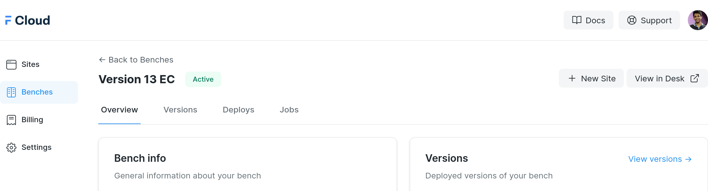
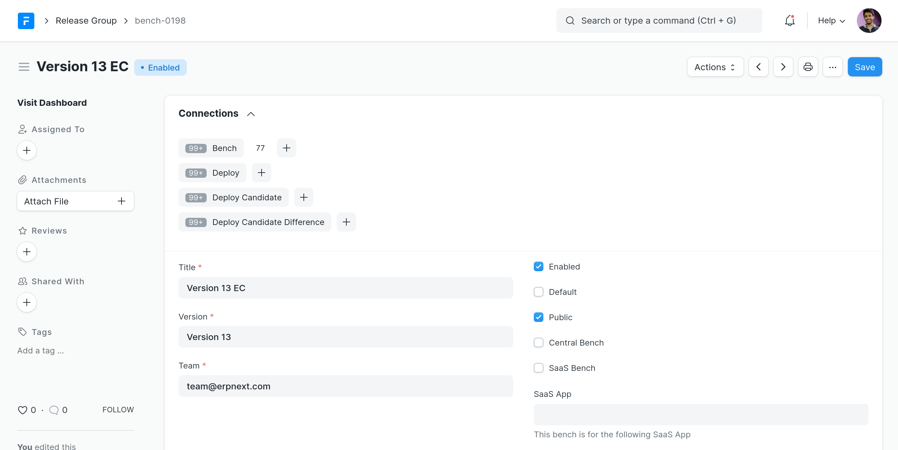
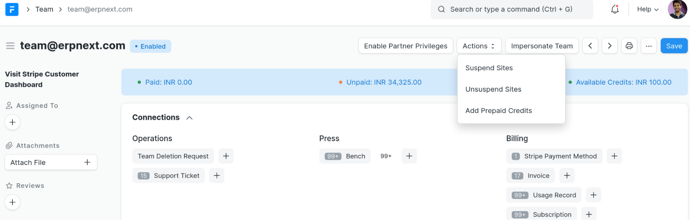
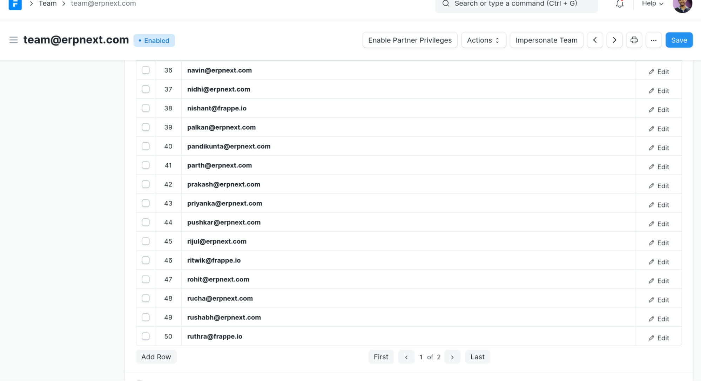
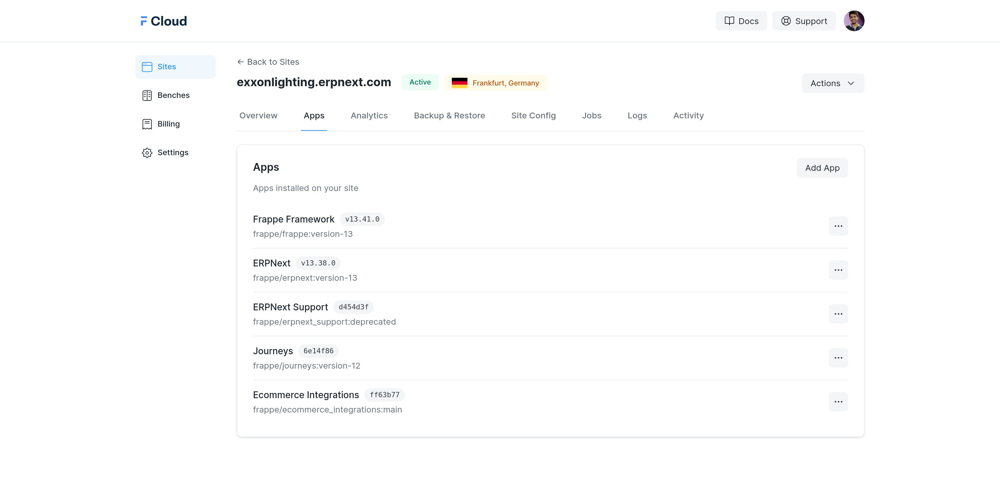
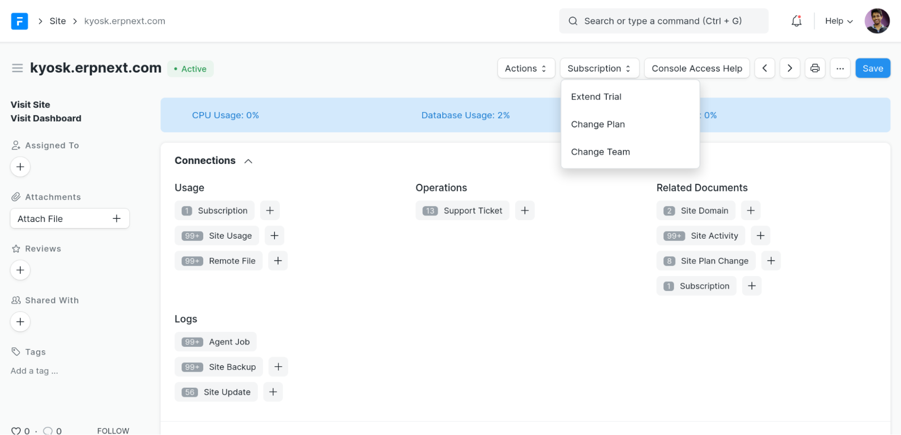

This documentation is intended to help consultants carry out daily operational tasks on FC smoothly.

### Terminology


| Term | Description |
| --- | --- |
| FrappeCloud | Platform for hosting customer sites |
| Team | A team represents a group of people. Every account created on Frappe Cloud belongs to a team. If a user signs up on Frappe Cloud without an invite, they’ll belong to their own team. A Team document has a child table of user emails |
| Desk Page/Document/Doc | Any webpage that starts with *frappecloud.com/app* in the url, powered by Frappe Framework, similar to the one you see on frappe.io. Customers of Frappe Cloud cannot access these pages |
| Dashboard Page | Any webpage that starts with *frappecloud.com/dashboard* in the url, powered by Vue js, custom UI for users. Customers of Frappe Cloud only see these pages. |

### Site Desk Page

* Go to frappecloud.com/app and search for Site List
* In the site list, search for the required site and open it

### Visit Dashboard page from Desk page

* In the desk page of site, use the **view in dashboard** link in the sidebar to see the corresponding Dashboard page of site.

  


### Visit Desk page of Site from Dashboard

* From the dashboard page of site, click on Actions -> **View in Desk** to see desk page

  


### Visit Desk page of Bench Group from Dashboard

* From the dashboard page of bench group, click on **View in Desk** to see desk page. This corresponds to the **Release Group** doctype.

   


### Visit Desk Page of Team

* Go to frappecloud.com/app and search for Team List
* In the Team list, search for the required team and open it

### Visit Dashboard from Team's perspective

* From Team’s Desk page, click on **Impersonate Team** button

  


### Adding Credits to a team

* At times when customers pay via alternate means, credits equivalent to the amount they paid can be given by using **Add prepaid credits** option under **Actions** in the Team document.

  


### Add/Remove users from a Team

* In a team's desk page, add/remove the user from the Team Members child table.

  


### Add app to Site

From the dashboard page of the site, go to apps section and click on **Add app**

  


Then you can select an app from the list shown. If the app you desire is not found on the list, contact a Frappe Cloud developer.

### Change Plan

* In the Site’s Desk page, Subscription -> Change Plan

  


### Change Ownership of a Site

* In the Site's Desk page, Subscription -> Change Team

  


* Enter the team name you want to transfer the ownership to along with the reason to transfer.

  


### Change Ownership of a Bench Group

* To change the team of a bench group, simply change the team of the corresponding [Release Group](#visit-desk-page-of-bench-from-dashboard).

  


### Create Team for a project (partners)

In some cases, it may be so that multiple partners are working on features for a project, hence they would want access to same Bench Group on FC. For these cases, we can create a new team and add the required partners as members in this team.

1. Signup on FC in incognito tab with `username+project_name@frappe.io` email. The `+` is important, i.e if your company email is `balamurali@frappe.io`, and project is Karam, use `balamurali+karam@frappe.io`.
2. Complete signup with the verification email you get in your company email inbox (`balamurali@frappe.io` in this case)
3. Mark your account as Free from [desk page](###visit-desk-page-of-team) of the newly created team
4. Invite other parties involved in the project to this newly created team from settings in your FC dashboard
5. Change bench group ownership to the newly created team


> This method works because we use Gmail for company email. Gmail allows for email aliases using + after our username.
> 
> 

### Central/ERPNext.com Sites

* These sites are the ones migrated from central to Frappecloud.
* They are all under common team i.e *central@frappecloud.com* and common plan i.e *Central Site*
* Frappecloud pricing doesn't apply to them

### Extend trial date of a site

* In the Site's desk page, click Subscription -> **Extend Trial**

### Update limits/expiry of Central/ERPNext Site

* Open the **Support Profile** doc on `frappe.io`

  


* Update the limits or expiry as per requirement and click Save.

### Resetting the Usage Limit for a Site


> For consultants, please take a help of an Engineer.
> 
> 

* SSH into the site server using User SSH Certificate.
* Once you are in the site bench ie. after running `docker exec -it <bench-name> bash`
* Start redis-cli by running `redis-cli -p 13000` command.
* Usage limit can be reset by deleting the latest redis rate-limit-counter keys
* To see the avalaible keys,


```
KEYS <db_name>|rate-limit-counter*
  

```
* To delete a key,


```
DEL <db_name>|rate-limit-counter-XXXXX
  

```

> db*name can be found in site*config file of the site
> 
> 

### Suspend and Unsuspend a site

* To suspend a site, click on **Suspend** from *Actions* button.

  


* To unsuspend a site, click on **Unsuspend** from *Actions* button.

  


> Once a site is suspended, it will be archived after 30 days.
> 
> 

### Archive/Drop a site

* To archive or drop a site, click on **Archive** from *Actions* button.

  


> Once a site is archived, it can't be restored back again.
> 
> 

### Transferring Central Site to Frappe Cloud customer

1. From Site doc, go to Subscription > Change Team and select the team you want to move the account to
2. From Site doc, go to Subscription > Change Plan and select desired plan
3. From dashboard page of site config, remove `limits` key and values
4. Uninstall Journeys app and ERPNext Support app
5. Uncheck free site checkbox if checked (Billing Section)
6. Move them to a non ERPNext Release Group (`bench-0001`, `bench-0020`) so they don’t get free emails and other things in `common_site_config` (You may skip this step for now)

### Replicate a Site

1. Take an **Offsite backup** of the site you want to replicate. Skip this step if last Offsite backup (usually a day old) is fine


	* Open desk page of site you want to copy
	* Go to linked **Site Backup** doctype list
	* Create new
	* Check the `with files` and `offsite` option and save
	* Go to dashboard page of site to see progress and wait for it to finish
2. Open [Site Replication](/app/site-replication) doctype list


	* Enter name of the site
	* Enter new subdomain. Eg: `xxx-copy` if you want to create `xxx-copy.frappe.cloud`
	* Save. This will replicate site in the same bench group.


> Be careful when taking backup of large sites (>15G) as it might slow the site down depending on what server it's on.
> 
> 

### Restore Offsite backup on site without download

1. Take an **Offsite backup** of the site you want to replicate. Skip this step if last Offsite backup (usually a day old) is fine


	* Open desk page of site you want to copy
	* Go to linked **Site Backup** doctype list. Keep this open in another tab.
	* Create new
	* Check the `with files` and `offsite` option and save
	* Go to dashboard page of site to see progress and wait for it to finish
2. Restore backup on target site


	* Open desk page of site **you want to restore to**. Eg: `xxx-copy.frappe.cloud`. Note that the data in this site **WILL BE LOST**.
	* Go to *Remote Files* section
	* Fill **Remote Database File** , **Remote Private File**, **Remote Public File** fields using value of fields from the tab you kept in previous step  
	* Save
	* Actions -> Restore Site. Note that the data in this site **WILL NOW BE OVERWRITTEN** with the data in the backup
