This guide shows you how to setup your development machine for Frappe Cloud development. By the end of this guide, you will have a replica of the FC production environment.

> “Patience is bitter, but its fruit is sweet.” – Aristotle

Introduction
------------

- `f` servers: These host your bench (`f` is for Frappe Apps)
- `m` servers: These host the database (`m` is for MariaDB)
- `n` servers: These are proxy servers (`n` is Nginx, which does the proxying)

Prerequisites
-------------

### Softwares

You should have the following software packages installed on your computer before proceeding:

1. Docker: Latest, don't forget to give `docker` sudo access!
2. Certbot: Latest
3. dns-route53 plugin for certbot: `pip3 install certbot-dns-route53`
    

### Credentials from Frappe Assets

You will need access to the following IAM accounts. If you're working at Frappe, you can request them from `Frappe Assets` at frappe.io:

1. Hetzner
2. Digital Ocean
3. AWS
    

Creating Servers on Hetzner
---------------------------

[Hetzner](https://www.hetzner.com/) is a cloud hosting provider that we will use to create our servers (`n`, `f` and `m`). In production, we use digital ocean but for development purposes, hetzner is a better value for money.

The naming convention used can be seen in the servers list:

`<server-type><server-number>.<name-initial>.fc.frappe.dev`

For example, f1.g.fc.frappe.dev is the first `f` server and `g` is for Gavin.

> Don't forget to add your default public SSH keys during server creation as Ansible plays rely on default SSH keys.

Now, create **3 servers** in the `Helsinki` region, using either `Ubuntu 20.04` or `Ubuntu 22.04` as the operating system. Other Ubuntu versions will introduce incompatible package dependencies (last verified on Sept 17, 2025).

1. `n1.<unique-name-initial>.fc.frappe.dev`: CPX11 type.
2. `f1.<unique-name-initial>.fc.frappe.dev`: CX22 type.
3. `m1.<unique-name-initial>.fc.frappe.dev`: CX22 type.
    

After the creation of the above mentioned servers, create a network resource and attach all the servers created above to that network resource.

Note down the Public and Private IP Addresses of all the three servers.

Creating DNS records in AWS Route53
-----------------------------------

1. Go to the AWS Console (again, credentials are in Frappe Assets), navigate to `Route 53 > Hosted Zones`. Click on `fc.frappe.dev` domain name.
2. You have to create 4 DNS `A` records here. 
   a. One record will be a wild-card sub-domain: `*.<name-initial>.fc.frappe.dev` pointing to the IP address of the `n` server created in the previous section.
   b. The other 3 records will be for `f1`, `n1` and `m1` respectively. Use the IP address from the previous step. You can have a look at other such records if you get confused at any point.

Now, make sure you can `ssh` (as `root`) into all the three servers using thier domain names. For example:

```
> ssh root@f1.h.fc.frappe.dev
```

Create your `press` site
------------------------

On your computer, run `bench get-app https://github.com/frappe/press`.

> If you are on a M series Mac computer and you get an error related to "go" when installing press. Here's what you can try:
> 
> 1.  Install go binary - `brew install go`
>     
> 2.  `go env -w GO111MODULE=off`
>     
> 
> After this, try running the get-app command again.

  

Now, create a new site and install `press` on this site.

Open the site and login as Administrator.

Press Settings
--------------

### Create a `Root Domain`

Navigate to `Root Domain List` (AwesomeBar to rescue!) and create a new document. Fill up the details as below:

*   Name: `<your-domain-name>`, e.g. `h.fc.frappe.dev`
    
*   Default Cluster: `Default`
    
*   AWS Access Key ID: Get from `AWS Console`
    
*   AWS Secret Access Key: Get from `AWS Console`
    

Save it.

> You can get your Access Keys by going to AWS Console > IAM > User > John Doe (create one if required) > Security credentials > Access Keys

Open `Press Settings` now. Now, set the `Domain` to the root domain you created in the previous step and cluster to `Default`.

Now, there is going to be a lot of back and forth between your terminal and `Press Settings`, so sit tight.

### Let's Encrypt

Scroll down and expand the `Let's Encrypt` section. Before entering the details here, you have to create two directories on your local computer (it is better to place this at user level, e.g. `/home/<user>/`):

1.  `.certbot` -> directory
    
2.  `webroot` -> directory, inside the .certbot directory
    

Now, fill the `Certbot Directory` and `Webroot Directory` with the absolute path of the above two newly created directories respectively. Leave out other fields as it is. You can enter your email if you want.

Save the settings.

### Docker

Now, Scroll down to `Docker Registry` section.

Fill in the fields as given below:

`Docker Registry URL`: registry.digitalocean.com/staging-frappe-cloud

`Docker Registry Namespace`: Any name you like, e.g. `hussain-staging`

Download Docker Credentials from https://cloud.digitalocean.com/registry/settings?i=abbd47 and then decode the auth string and use it for both `Docker Registry Username` and `Docker Registry Password`

> The decoded string should be in the following format:
> 
> `dop_v1_daaaxxxxxxxxxxxxxxxxxxxxxxxxxxxxxxxxxxxxxxxxxxxxxxxxxxxxxxxxxxxxxxxxx:dop_v1_daaaxxxxxxxxxxxxxxxxxxxxxxxxxxxxxxxxxxxxxxxxxxxxxxxxxxxxxxxxxxxxxxxxx`  
>   
> Use the string before colon (:) as `Docker Registry Username` and `Docker Registry Password`

Again, save the settings and scroll down to `Docker Build` section.

Go to your terminal and `cd` into your `bench` directory. Create two directories here:

1.  `.clones`
    
2.  `.docker-builds`
    

Go back to the `Press Settings`and paste the absolute paths of the above two directories to the `Clone Directory` and `Build Directory` respectively. Leave the other field empty and save the settings.

Sometimes, there is an issue while uploading a docker image in the background and you have to manually `push` it to registry. For that case, you have to login to digital ocean registry through docker before pushing. You can do this by running this command:

    > docker login -u <do-registry-user-id> -p <do-password> registry.digitalocean.com
    

### Stripe Settings (optional)

This step is optional and is required only if you are planning to work on billing. In the Stripe Settings section, create a new Stripe Account from the link field.

You can signup for a new Stripe account from [https://dashboard.stripe.com/](https://dashboard.stripe.com). By default, Stripe gives you a test account which is enough for our development purposes.

Get the Publishable Key and Secret Key from Stripe dashboard and create your Stripe Account and set it in Press Settings. Set values for Credits on Signup fields. For e.g., INR 1800 and USD 25.

Now click on Create Stripe Webhook. It should create webhook endpoints on Stripe and set the field Stripe Webhook Endpoint ID.

That's it for Stripe Settings.

Setting up SSH Agent
--------------------

Before proceeding to the following steps, we need to make sure you are able to SSH to the aforementioned servers without being prompted for a password. This is done using SSH keys.

If your private key is encrypted with a passphrase, this passphrase must be entered every time you attempt to connect to an SSH server using public-key authentication. Each individual invocation of ssh or scp will need the passphrase in order to decrypt your private key before authentication can proceed. This prompt will block Ansible Plays from running through press.

An SSH agent is a program which caches your decrypted private keys and provides them to SSH client programs on your behalf. In this arrangement, you must only provide your passphrase once, when adding your private key to the agent's cache.

Make sure your private key file has correct permissions:

    chmod 600 ~/.ssh/id_rsa
    

### Linux instructions (MacOS users must read)

Update your `.zprofile` (or `.bash_profile`) because that's where environment variables are set:

    eval "$(ssh-agent -s)" # To start the agent
    ssh-add ~/.ssh/id_rsa
    

You can logout and log back in, then run `ssh-add -l` to check if your key is added. If it's not added, you'll get an error like `The agent has no identities.`. If it's added, you'll see the key's fingerprint.

If your key is protected with a passphrase, you should add it to a keyring. You can check [this](https://wiki.archlinux.org/title/KDE_Wallet#Using_the_KDE_Wallet_to_store_ssh_key_passphrases) for a guide on how to set it up.

> Note that the above step is **NOT OPTIONAL** if your private key is protected with a passphrase.

### MacOS instructions

MacOS includes a special variant of `ssh-add` that allows it to use the keyring easily. Following link won't work if you're using some brew package. Please read [this](https://apple.stackexchange.com/questions/48502/how-can-i-permanently-add-my-ssh-private-key-to-keychain-so-it-is-automatically) guide on setting up ssh-agent on MacOS

> To confirm if you've done everything correctly, you can restart your computer and run
> 
>     ssh-add -l 
> 
> . The output should show your key's fingerprint if everything is set up correctly.

Setting up Proxy server (`n` server)
------------------------------------

Go to the `Proxy Server` list and click `+ Add Proxy Server`. Fill in the details as given below:

Hostname: `n1` (`n2`, `n3`, if you want to create more Proxy servers)

IP: IP Address of the `n` server. Private IP: Private (internal) IP Address of the `n` server. Can be found in `Hetzner` console.

Click on save.

> Note: The agent password will be set automatically for you.

Now, click on the `Actions` dropdown button, which is located next to the `Save` button and click on `Setup Server`. The server doc status should change to `Installing`.

This will setup the server. We use `Ansible` to automate the infrastructure, so, once you click on the `Setup Server` button, `Ansible Play`s will be created and run in the background to setup the server (install necessary software, perform essential configuration changes and more). Each `Ansible Play` document creates a number of `Ansible Task`, which is an individual task that will be carried out to setup the server.

Navigate to `Ansible Task List` and you should see some tasks which will have a particular status. For example, `success` means the task completed successfully and `running` means the task is currently running. You should confirm that all the tasks are eventually `success`ful.

After some time, when the tasks have completed to run, the `Proxy Server` will go to `Active` state.

If there is any error (for example, if the `Proxy Server` goes into `Broken` state) or a task keeps running forever, go to the `Error Log List` and you will most probably find a log that corresponds to the task and more information on why it failed.

> If the Ansible Task "Clone Agent Repository" fails, you might want to generate a personal access token and edit the git clone URL in `press/playbooks/roles/agent/tasks/main.yml` at the agent github URL line. It should be in the format: `"https://<github-username>:<personal-access-token>@github.com:/frappe/agent"`

Setting up DB server (`m` server)
---------------------------------

In this section, we will move on to create a `Database Server`. Go to the `Database Server List` and create a new document. Fill in the fields as given below:

*   **Hostname:** `m1`
*   **IP:** External IP address of the `m` server
*   **Private IP:** Internal IP address of the `m` server

Now, you have to follow the same steps as for the proxy server. Save the document and do setup server. While ths server is setting up, you can move on to setting up the `f` server as this takes a long time to finish.

Setting up App server (`f` server)
----------------------------------

In the proxy server section, we created and set up the `Proxy Server` which sits in the front and forwards traffic to various `f` servers. Now, `f` servers are where the benches (along with the sites) are present. The databases are on different `m` servers and the sites hosted in the `f` servers use those databases.

Go to the `Server List` and add a new server document. Fill in the details as given below:

Hostname: `f1` Cluster: `Default`

IP: External IP address of `f` server Private IP: Internal IP address of `f` server

Proxy Server: Select the `Proxy Server` which we created in a previous section. Database Server: Select the `Database Server` which we created in the previous section.

Look for the `Use for Build` checkbox and enable it.

Leave other fields as they are. Save the document.

Now, click on Actions > Setup Server and wait for it to complete. After that, click on Actions > Add to Proxy.

That's it for the `f` server.

Setting up Builds
-----------------

Under **Press Settings** > **Docker** > **Docker Build** set **Build Server** to the app server you have created in the previous set.

Now, when you run a _Build and Deploy_, the image that is created for the deployment will be built on the Build Server.  
  

> **Note**: You need to add **sync** queue, in your common\_site\_config.json [**Ref**](https://github.com/frappe/press/blob/78a736c0acefcfce7d74767620688de5f7a2d059/deployment/common_site_config.json#L28)
> 
>       "workers": {
>         "sync": {
>           "timeout": 300
>         }
>       }

  

Creating a Free Plan
--------------------

You should create at least one site plan for the tenants to be able to start using the dashboard and creating sites. Without this, the _Create Site_ wizard will not work as intended. This can be done using the `Site Plan` doctype. Go ahead and create a Free site plan.


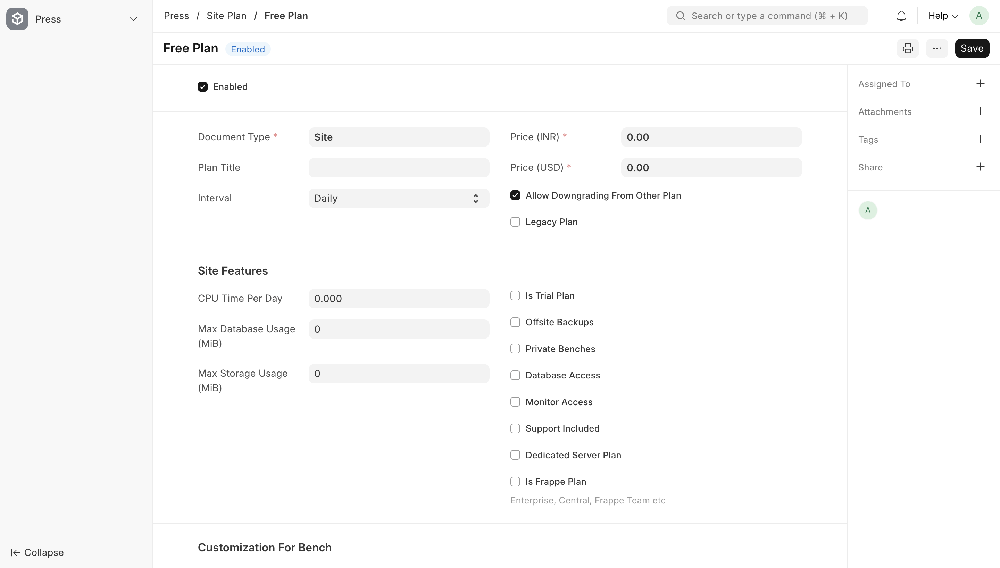


Now under Roles, add `Press Admin` and `Press Member`.


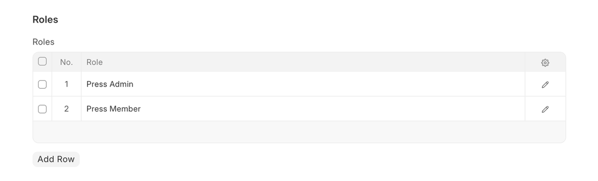


Creating an App
---------------

The next step is to create an App that will ultimately be installed on our site. The first app in any release group must be `frappe` (Frappe Framework), the name is case sensitive. Navigate to `App List` page and click on `'+ Add new App'` button on the top-right corner. Fill in the details as below:


Creating an App Source
----------------------

Now, we need to create an App source for this app. Navigate to `App Source` list page, create a new document and fill in the details as below:


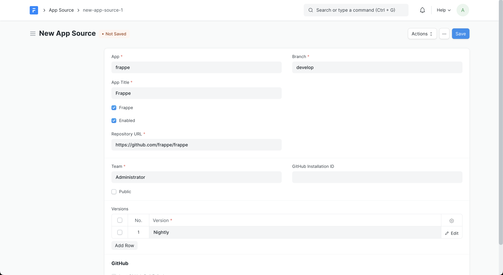


Approving the App Release
-------------------------

Now, go to the `App Release` list page by clicking on the App Release chip. You should see an app release created for the `frappe` app that we created in the previous step. Open that document and change its status from Draft to Approved.


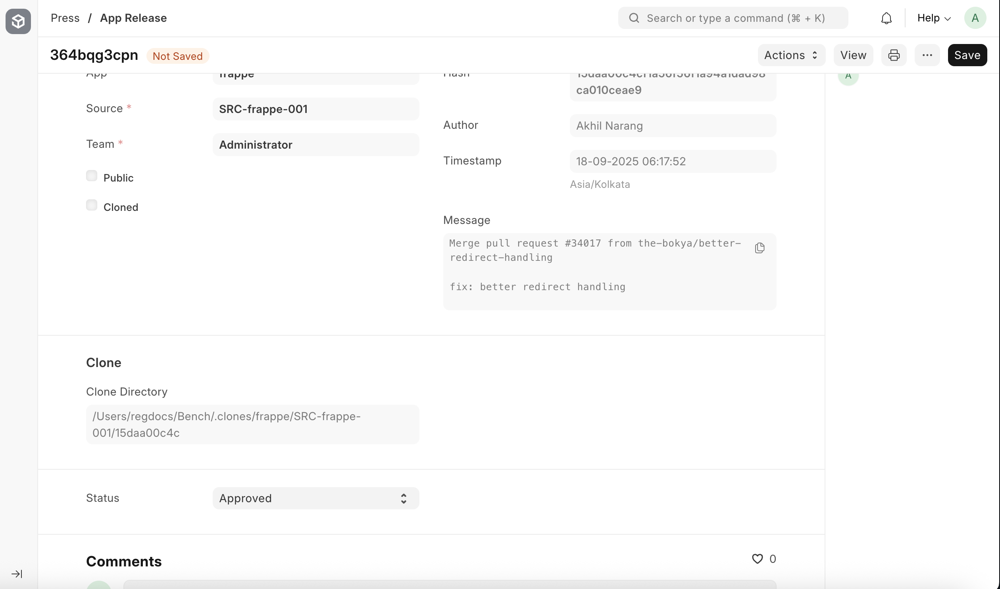


Creating a Release Group
------------------------

> If you are on a Mac add `export NO_PROXY=* OBJC_DISABLE_INITIALIZE_FORK_SAFETY=YES` to your shell configuration file (like .zshrc) to avoid having `Agent Jobs` stuck at `Undelivered` status.

Navigate to the `Release Group` list and create a new release group. The details to be filled are shown below.


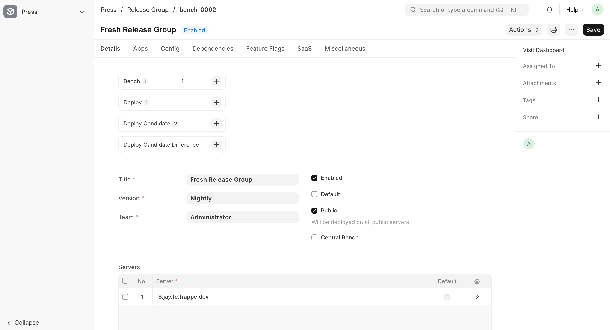

Make sure at least one `f` server is added to your chosen _Release Group_. New sites cannot be created if no server is added. Ensure the Release Group is marked **Public**; otherwise, it will remain private and act as an isolated bench.

Go to the `Apps` tab of the release group and select the app source that you created in the previous step, like in the screenshot below.


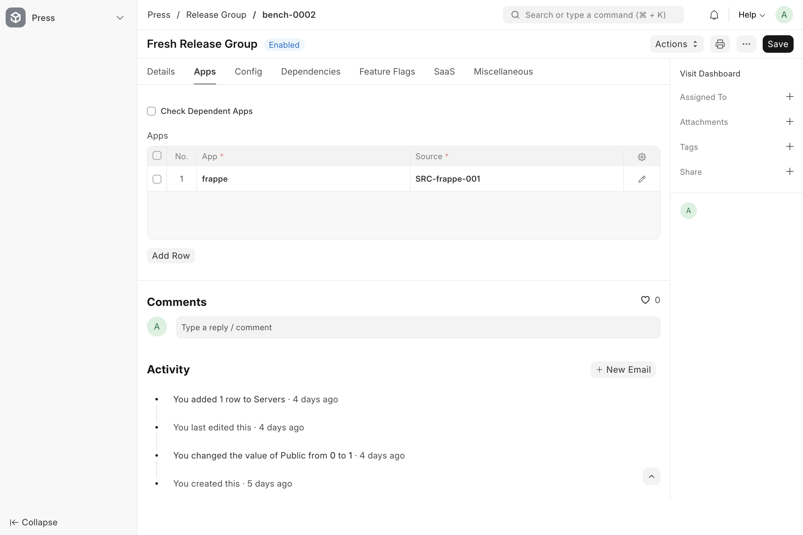

Now click save.

Once you save the release group document, a `Deploy Candidate` is automatically created for this release group. In fact, a deploy candidate is created any time you make changes to the `Release Group`.

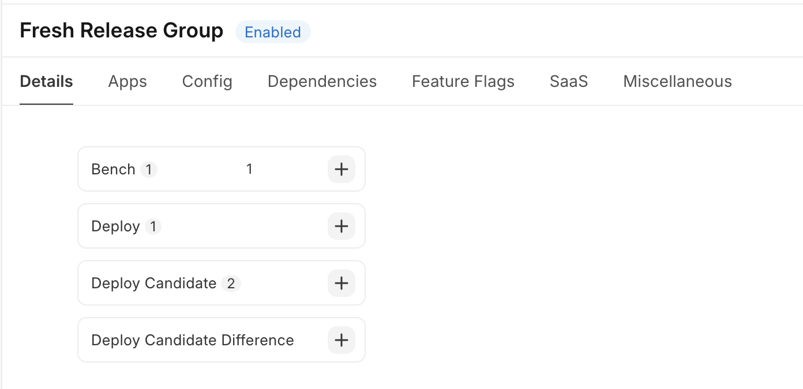

Click on the `Deploy Candidate` chip and this will take you to the `Deploy Candidate` page which is filtered for the current `Release Group`. Select the `Deploy Candidate` (are named like `bench-xxx`) that was created latest. You should only have one if you never created a release group before. Now, click on `Actions` and then `Schedule Build and Deploy`.

This will build the docker image for this bench group, upload it to the digital ocean image registry and also deploy it to your `f` server.

You can click on `Visit Dashboard` link on the top-left corner to view the progress of the build and deploy step.

> If you see an error like `permission denied while trying to connect to the Docker daemon socket`, it usually means that the updated group permissions have not yet taken effect for the frappe user in the target server. Restarting the virtual machine should start a fresh user session and apply the new group membership, resolving the permission issue.


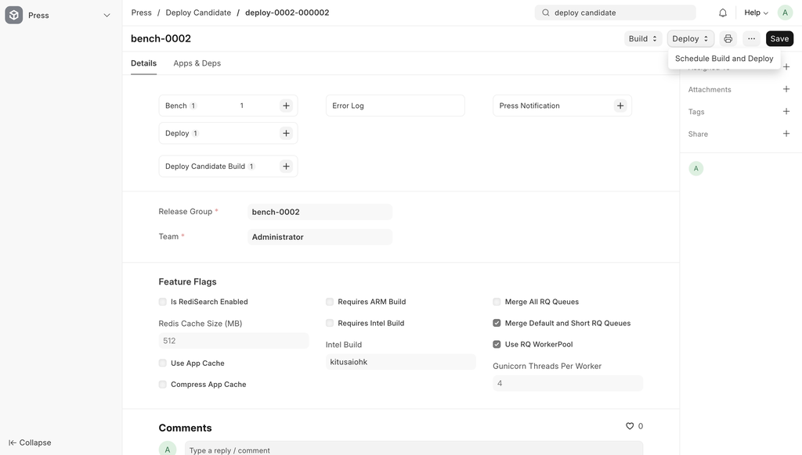

Once the image is deployed, you can go the bench list and you will find a new bench there. This was created using the `Deploy Candidate`.

Deploying a New Tenant Site
---------------------------

It's time to create your first tenant site!

1\. Open the dashboard by changing the browser address path to `/dashboard`.

2\. From the sidebar, click on **Sites**, then select the **\+ Add Site** button to start setup. Configure as shown below in the screenshot.


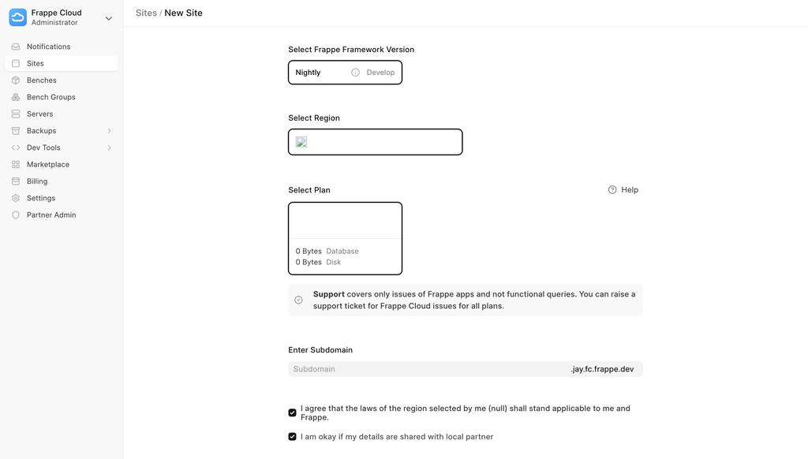

Choose a subdomain: this will be the site's primary address. You can link a custom domain later if needed.

3\. Click `Create site`. You'll be redirected to the **Insights** tab, where you can track the deployment progress in real time.


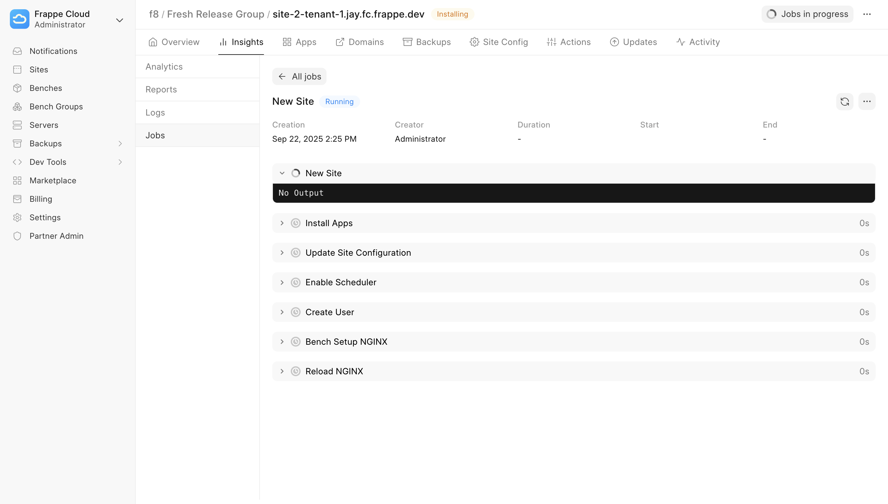

Wait until the status updates from `Running` to `Success`.

4\. Go back to the **Sites** page. Your new site will now appear in the list, as shown below.


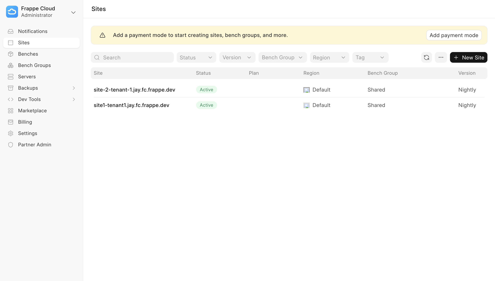


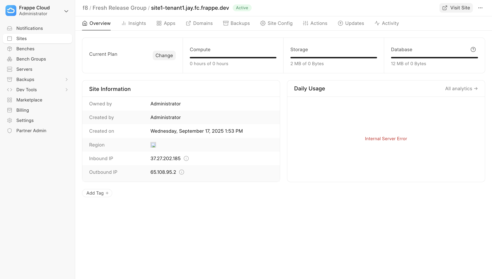

Resolving issues
----------------

One of the issues that you may get into is not being able to obtain a TLS Certificate for the root domain. If that is the case, you have to manually call (via `console`) the `_obtain_certificate` method on the `TLS Certificate` document that was created for the `Root Domain` document that we created in the initial part of this guide.

Start the press site's IPython console.

    bench --site frappe-cloud.local console

Call `_obtain_certificate` method on the TLS Certificate document

```
    
    p = frappe.get_doc("TLS Certificate", "*.jay.fc.frappe.dev")
    p._obtain_certificate()
``` 

Testing
-------

When you run `bench init` or `bench setup requirements`, Frappe installs only the runtime dependencies listed in `requirements.txt`. Development dependencies are not installed automatically, since production environments do not require them.

To set up a development or test environment, install the python dependencies using bench. This [internally calls pip](https://github.com/frappe/bench/blob/4fdaaf6a21b7245e039fd8c3d9509b0de1f44b2e/bench/utils/bench.py#L97) to install the dependencies from the dev-requirements file:

    bench setup requirements --dev

This will install additional tools commonly needed in development:

*   **moto** — emulates AWS services locally. Required for tests that depend on AWS APIs.
*   **Faker** — generates fake data for test fixtures.
*   **pre-commit** — provides linting and formatting hooks that run before each commit.

If you encounter test failures related to missing AWS services or other dev tools, ensure you have installed the development requirements.

Before running your tests, make sure to [set up pre-commit](https://github.com/frappe/press/blob/develop/setup-pre-commit.sh), follow the [testing guide](https://github.com/frappe/press/blob/develop/guide-to-testing.md), and refer to [the instructions for running tests](https://docs.frappe.io/framework/user/en/testing#running-tests) once all development dependencies are in place.

Tips
----

*   Set `scheduler_tick_interval` to a smaller value (like 5) for faster Agent Job updates, since most of them don't take much time.
    

Conclusion
----------

If you made till here, well done and be proud of yourself. Now, its time to build awesome things. Good Luck with your journey on Frappe Cloud.