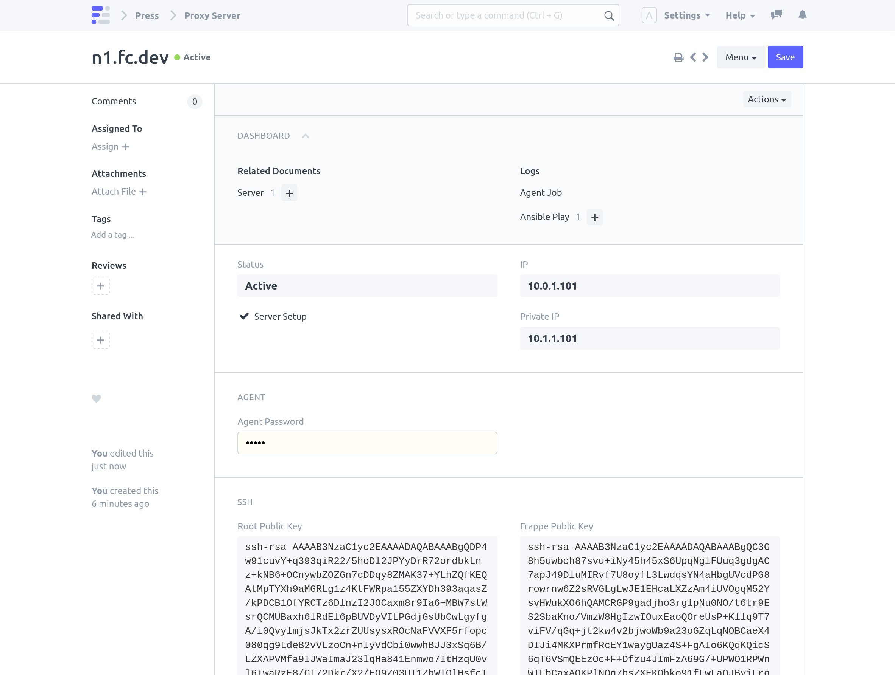

Proxy Server runs NGINX as a reverse proxy.

> Note: See [Server Setup](/internal/servers/server-setup) for detailed explanation.

#### Requires 
Press host must have root SSH access to the target machine.

#### Steps

1. Create a Proxy Server

    

2. Click on **Actions > Setup Server**

    

3. Setup Complete

    
