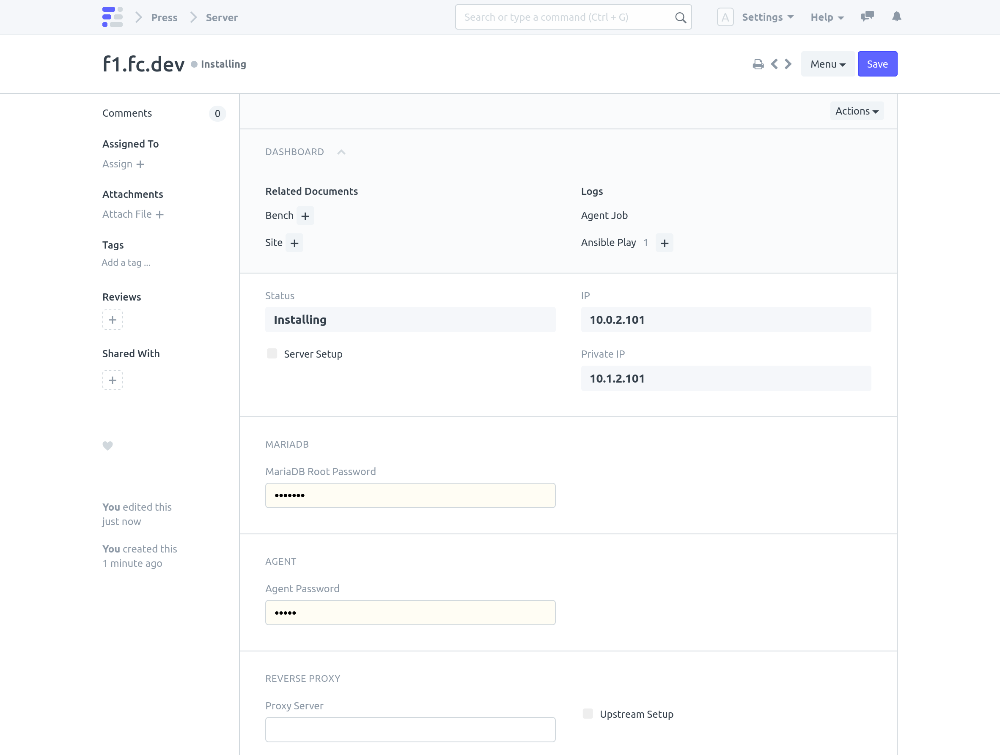
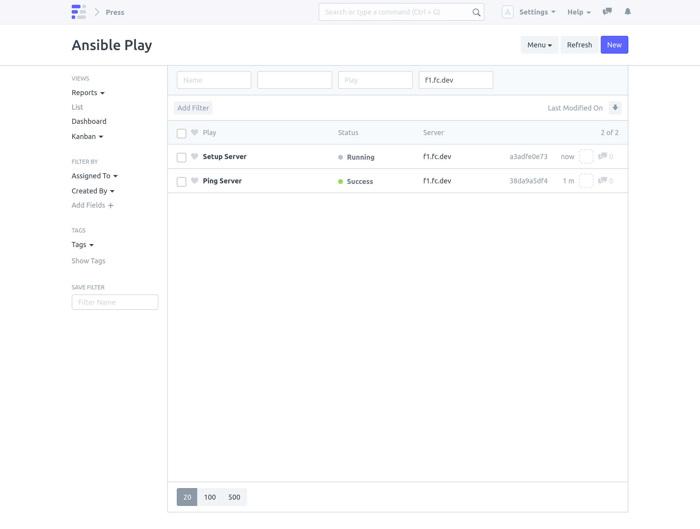
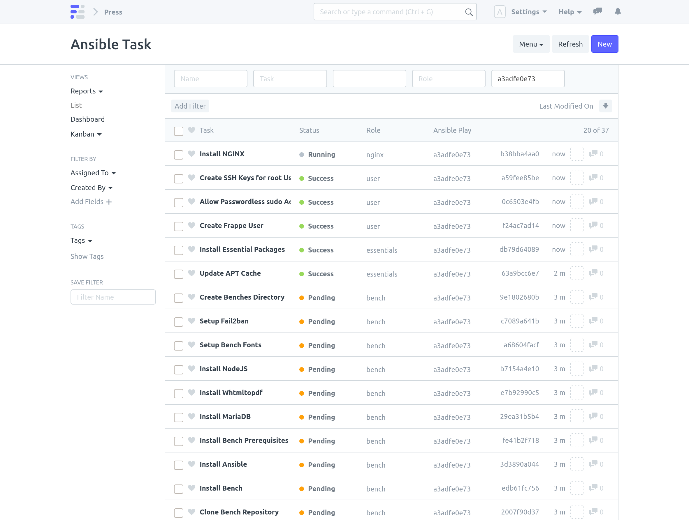
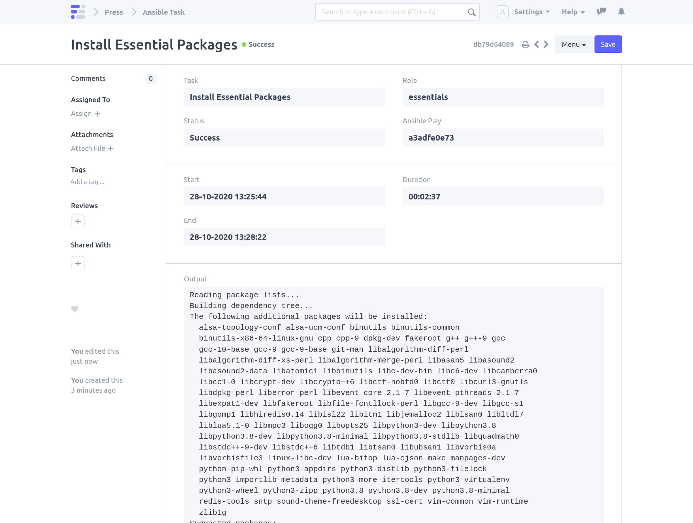
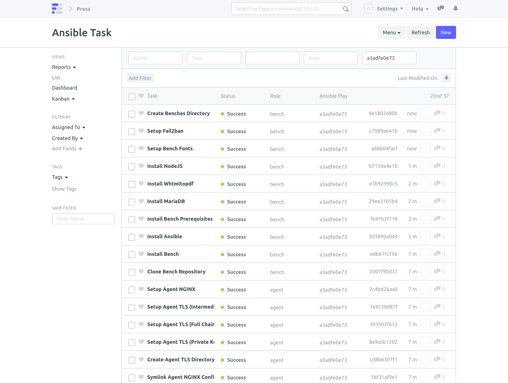
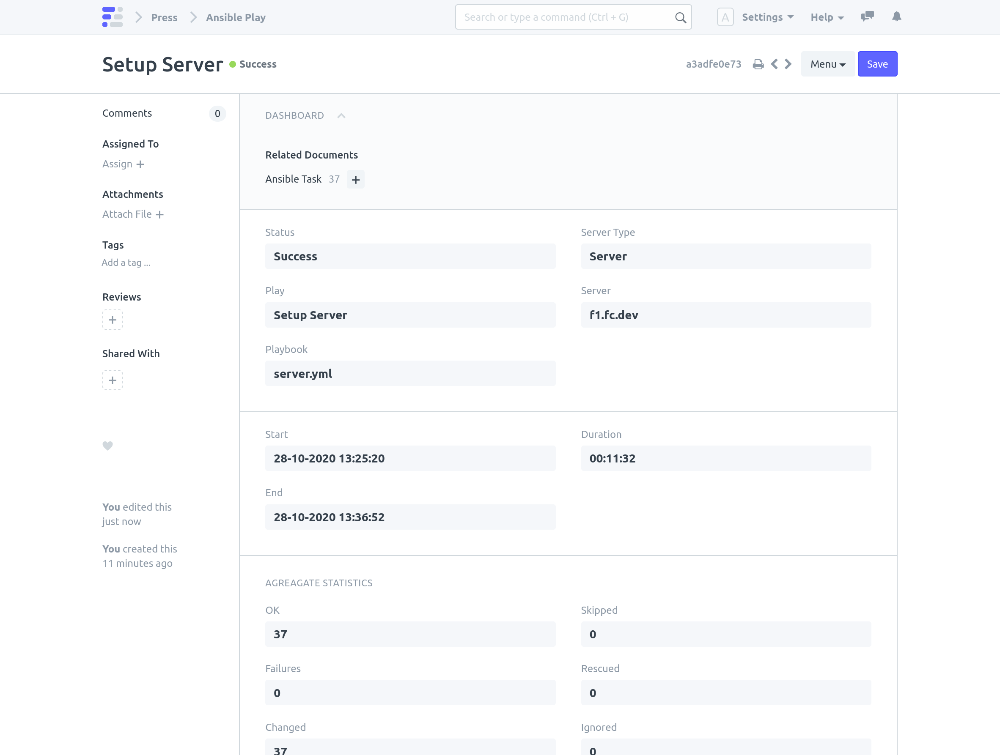
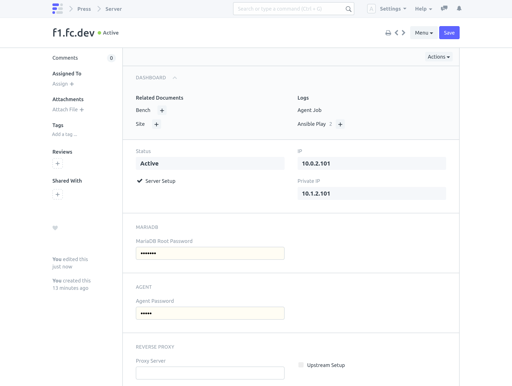
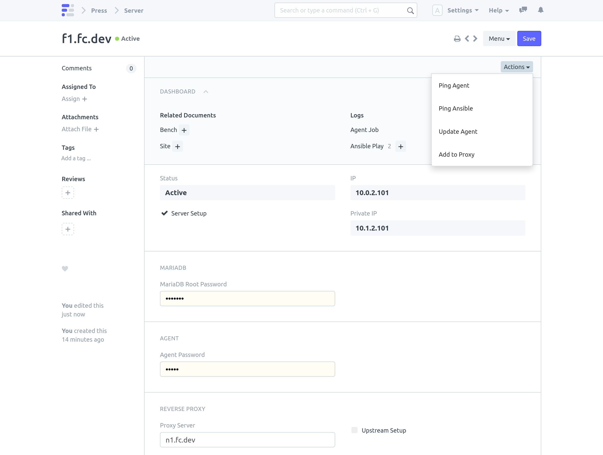
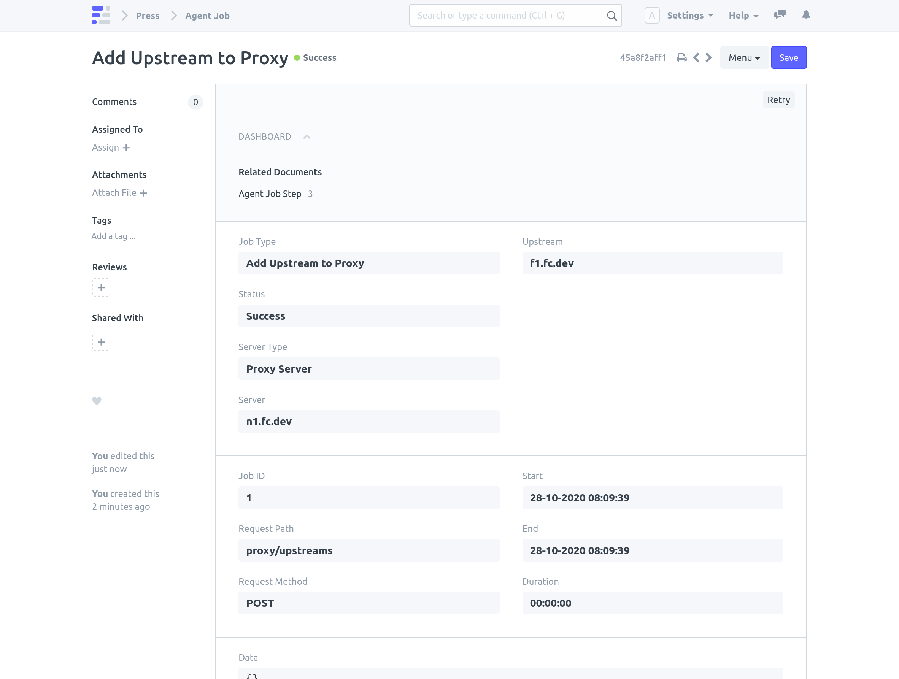

Server runs benches as well as its own MariaDB database.

> Note: [Proxy Server Setup](/internal/servers/proxy-server-setup) must be completed before Server setup.

#### Requires 
- Press host must have root SSH access to the target machine.

#### Steps

1. Create a Server Document and Save

1. Click on **Actions > Setup Server**

During the playbook execution, Server status is set as **Installing**.

> Note: Running a playbook blocks a worker for the duration of the play.

Setup Server action runs an Ansible playbook. The status of the play is tracked in Ansible Play and the tasks in the play are tracked in Ansible Task. play and task updates are reflected in realtime.

Once the playbook execution is complete, If failed, Server status is set as **Broken**. The Server setup can be retried with **Actions > Setup Server**.

If successful, Server status is set as **Active** and **Server Setup** field is checked. 

### Add Server to Proxy

This adds the Server as an NGINX upstream on the Proxy Server. This action is carried out using Agent. The status of this job can be tracked under Add Upstream to Proxy Agent Job. If successful, the **Upstream Setup** field is checked.

1. Set **Proxy Server** field and Save.

1. Click **Actions > Add To Proxy**

