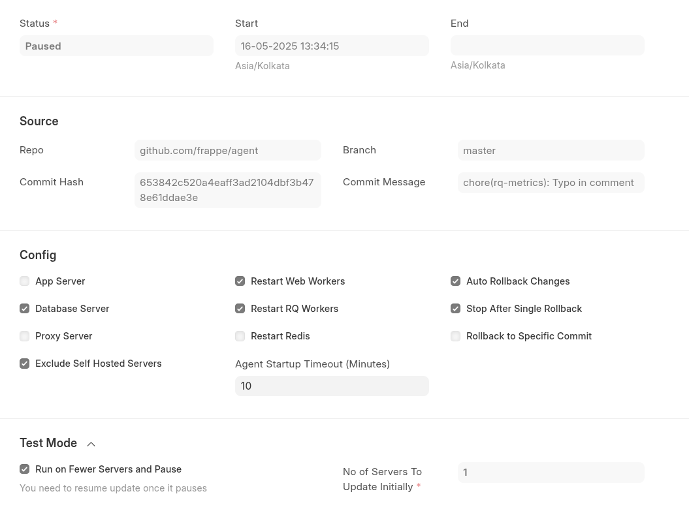
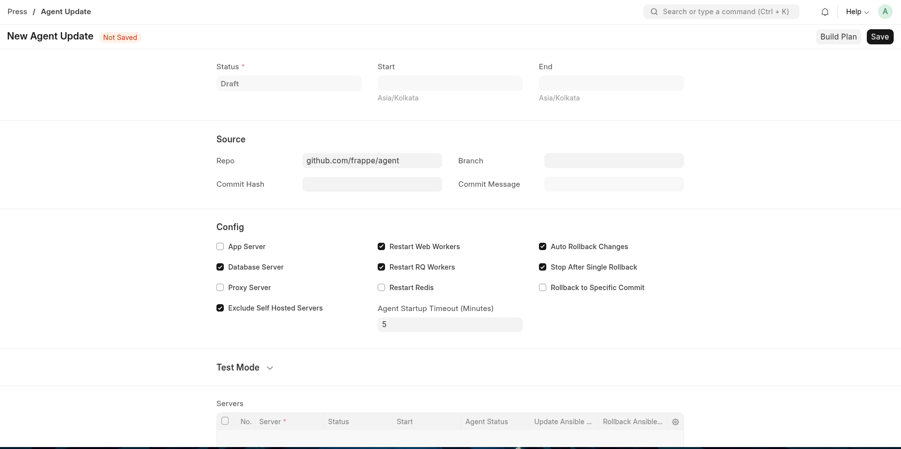
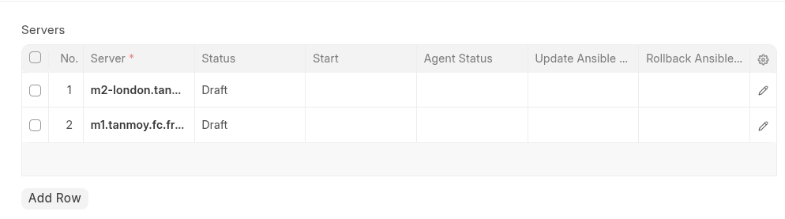
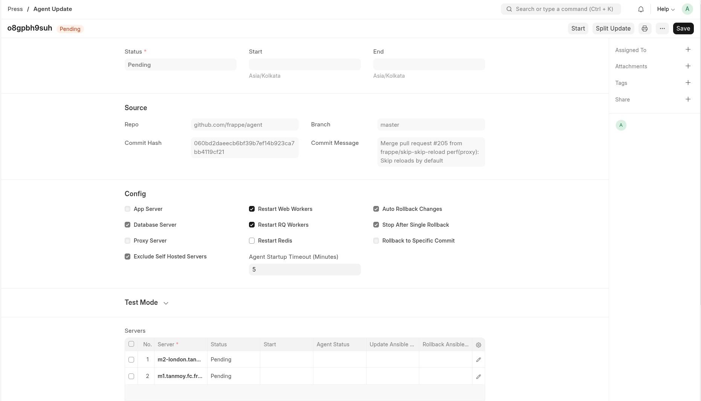
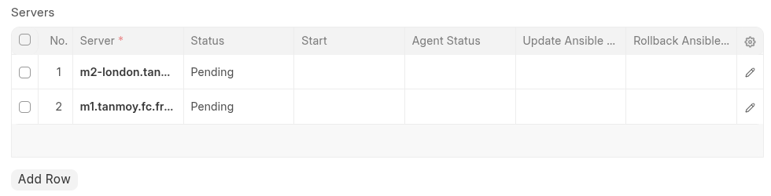
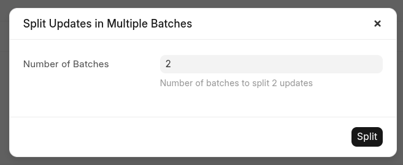
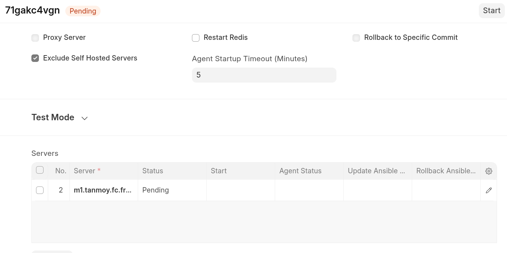

# Agent Update

Agent Update is an internal ops tool for updating the
[agent](https://github.com/frappe/agent) across servers in bulk. It updates
servers sequentially — triggering the update, verifying the agent comes back
online, and optionally rolling back if something goes wrong — before moving to
the next target.



## How It Works

1. An operator creates an **Agent Update** document with the desired
   configuration (server types, restart mode, rollback settings).
2. On save, the server list is auto-populated from active servers matching the
   selected types.
3. The operator clicks **Build Plan**. This fetches the currently installed
   agent commit from each server and plans the update. Servers already on the
   target commit are automatically skipped.
4. Once planning completes (status moves to `Pending`), the operator clicks
   **Start**.
5. A scheduled job (`process_bulk_agent_update`) picks up running updates and
   processes them one server at a time:
   - Halt agent jobs on the server.
   - Run the `update_agent.yml` Ansible playbook.
   - Wait for the agent to respond to a ping.
   - On failure, optionally roll back and resume agent jobs.
   - On success, move to the next server.
6. Final status is `Success`, `Partial Success`, or `Failure` depending on
   individual server outcomes.

## Doctypes

| Doctype | Purpose |
|---------|---------|
| **Agent Update** | The main document. Holds configuration, source info, and the child server table. |
| **Agent Update Server** | Child table row representing a single server to update. Tracks per-server status, commits, Ansible plays, and agent health. |

## Configuration

### General Info

The top section shows overall status, start time, and end time.

### Source

| Field | Description |
|-------|-------------|
| `repo` | Git repository path (e.g. `github.com/frappe/agent`). Defaults to the value in `Press Settings`. |
| `branch` | Branch to update from. Defaults to the `branch` field in `Press Settings`. |
| `commit_hash` | Specific commit to deploy. Auto-populated from the branch HEAD on save if left empty. |

### Server Types

Select one or more server types to include in the update:

- **App Server** (`Server`)
- **Database Server** (`Database Server`)
- **Proxy Server** (`Proxy Server`)

Self-hosted servers can be excluded via the `exclude_self_hosted_servers` flag.

### Restart Mode

Choose which processes to restart during the update:

| Option | Description |
|--------|-------------|
| **Restart Web Workers** | Always required at minimum. |
| **Restart RQ Workers** | Graceful restart — waits for running tasks to finish before stopping the worker. |
| **Restart Redis** | Requires both RQ and web worker restarts to be enabled. |

::: tip
Most updates only need a web worker restart. Avoid restarting RQ workers
unless the change requires it — a graceful RQ restart waits for in-flight
tasks, which can delay the update.
:::

### Rollback Settings

| Option | Description |
|--------|-------------|
| **Auto Rollback Changes** | Automatically rolls back to the previous commit on a failed update. |
| **Stop After Single Rollback** | Halts the entire run after the first rollback instead of continuing to the next server. |
| **Rollback to Specific Commit** | Rolls back all servers to a given commit instead of their individual previous commits. Useful in development environments. |

::: warning
Automatic rollback is only supported for agents with commits dated after
22 April 2025. Older agents must be updated manually. The planning step
detects and flags these servers.
:::

## Server Status Lifecycle

Each `Agent Update Server` row follows this state machine:

```
Draft → Pending → Running → Success ──→ (agent ping) → ✓ done
                     │                       │
                     ↓                       ↓ (timeout)
                  Failure → Rolling Back → Rolled Back → (agent ping) → ✓ done
                                  │                           │
                                  ↓                           ↓ (timeout)
                                Fatal                       Fatal
```

Servers already on the target commit are marked `Skipped` during planning.

## Usage

### Creating an Update

1. Create a new **Agent Update** document with the desired configuration.

   

2. On save, the server list is populated automatically.

   

   ::: tip
   Review the server list before proceeding. Remove any servers you want to
   exclude. Servers already on the target commit will be skipped automatically.
   :::

3. Click **Build Plan**. This runs in the background and may take a few
   minutes while it fetches the current agent version from each server.

4. Once complete, the status changes to `Pending`.

   

5. Click **Start**.

### Pausing and Resuming

Click **Pause** to stop processing after the current server finishes. A
**Resume** button appears to continue.

### Test Mode

To update a small number of servers first and pause for verification before
continuing:

1. Enable **Run on Fewer Servers and Pause**.
2. Set the number of servers to update initially.


After the configured number of updates complete, the run pauses automatically.
Click **Resume** to continue with the remaining servers.

### Splitting Updates

For large fleets, sequential updates can take a long time. Splitting divides
the server list into multiple independent **Agent Update** documents that can
run in parallel.

1. Build the plan first (status must be `Pending`).
2. Click **Split Update** and choose the number of batches.

   

3. New Agent Update documents are created, each with a subset of servers.
   Run them in parallel or one at a time.

   

   

::: tip
For example, 500 servers at ~2 minutes each would take ~16 hours
sequentially. Splitting into 10 batches brings that down to ~1.6 hours.
:::

### Force Continue

If the run ends with `Failure` or `Partial Success`, the **Force Continue**
action resets failed servers back to `Pending` and restarts execution. This is
useful after resolving an underlying issue on a specific server.

