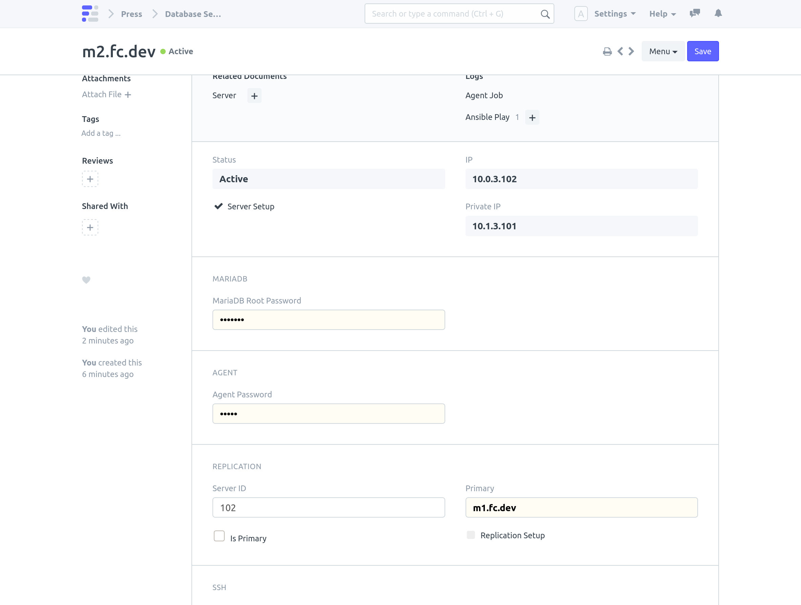
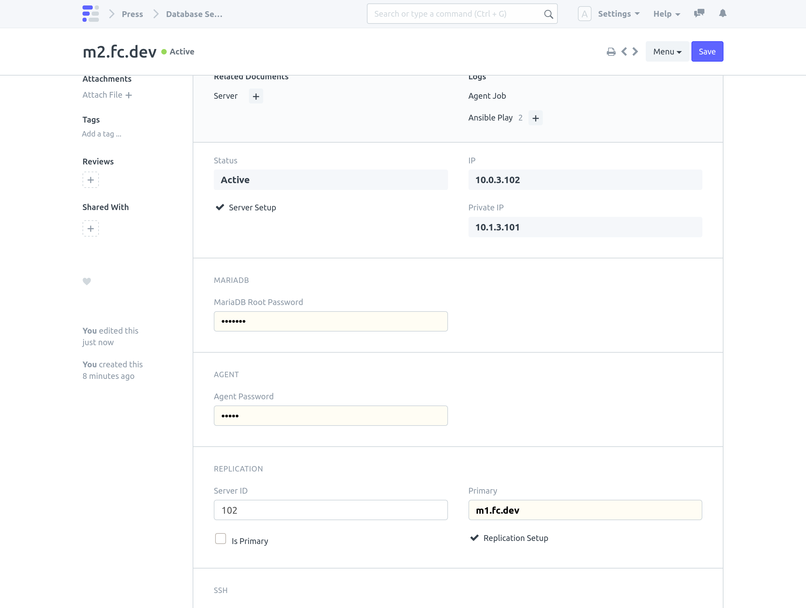

> Note: This will wipe data already present on the secondary Database Server.

#### Requires 
- Primary and secondary Database Servers should be already setup.

#### Steps

1. Set **Primary** field on the secondary Database Server

1. On Secondary Database Server Click on **Actions > Setup Replication**

 This runs playbooks on both primary and secondary Database Server.

1. Setup Complete

 **Replication Setup** field on secondary Database Server will be set.

