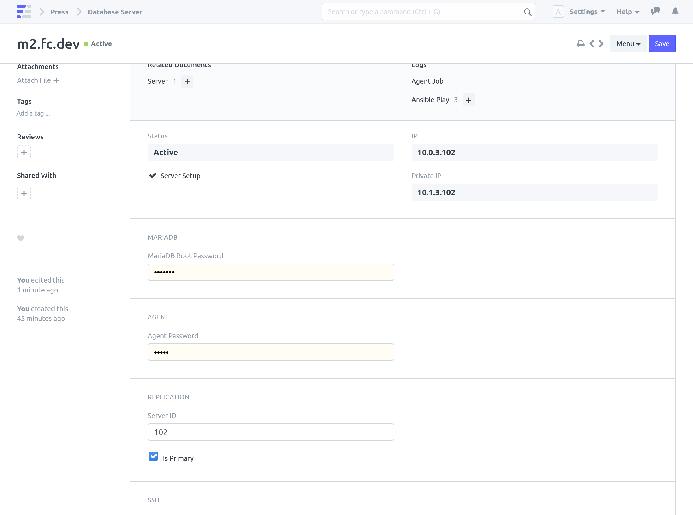

> Note: Minor Downtime + Data Loss ahead!

#### Requires 
- [Database Replication](/internal/servers/database-replication) should be already setup.

#### Steps

1. On Secondary Database Server Click on **Actions > Trigger Failover**

 This doesn't require the primary Database Server to be online. 

1. Failover Complete

 **Database Server** field will be updated on all Servers and Benches linked to the primary Database Server.

 Database Server will be promoted to primary.

