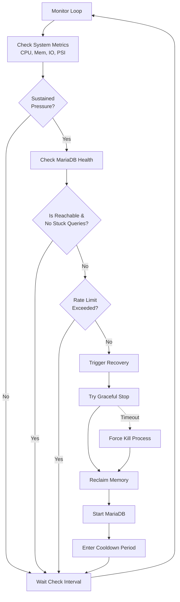

# MariaDB Monitor

A health and resource monitor for MariaDB designed to detect sustained system pressure (CPU, Memory, I/O) and gracefully recover the daemon to prevent hanging queries or severe performance degradation.

## Architecture & Flow



## Installation

```sh
# Ensure you are executing as root
sudo ./mariadb_monitor install
```

The installer will copy the binary to `/usr/local/bin`, generate a default configuration at `/etc/mariadb-monitor/config.yaml`, create the log directory `/var/log/mariadb-monitor`, and install a managed `systemd` service.

### Prerequisites

The monitor reads credentials directly from `/root/.my.cnf` to periodically query the MariaDB process list.

Ensure this section is populated correctly:

```ini
[client]
user=root
password=your_secure_password
socket=/var/run/mysqld/mysqld.sock
```

## Configuration

The default built-in configuration (which is exported to `/etc/mariadb-monitor/config.yaml` during installation) is tuned for a standard production setup:

```yaml
log_level: WARN
check_interval: 5s
cooldown_after_recovery: 2m0s
stop_timeout: 30s
window_size: 12
sustained_ratio: 0.7
psi_cpu_threshold: 80
psi_memory_threshold: 60
psi_io_threshold: 60
iowait_threshold: 50
memory_usage_threshold: 95
critical_memory_threshold: 98
swap_usage_threshold: 80
swap_headroom: 10
page_rate_threshold: 100000
io_freeze_timeout: 5s
max_recoveries_per_hour: 3
drop_caches_mode: 1
coredump_enabled: 0
```

### Configuration Parameters

#### Logging & Scheduling

- **`log_level`**: Controls the verbosity of the monitor's logs (e.g., `DEBUG`, `INFO`, `WARN`, `ERROR`). Logs are output to `/var/log/mariadb-monitor/monitor.log`.
- **`check_interval`**: The frequency at which the monitor wakes up to query system metrics (e.g., `5s`).
- **`cooldown_after_recovery`**: The duration to pause monitoring after executing a recovery action. This prevents the monitor from immediately crashing MariaDB again while the system stabilizes.

#### Recovery Tuning

- **`stop_timeout`**: The maximum amount of time to wait for a graceful shutdown (`systemctl stop mariadb`) during recovery. If this time is exceeded, the monitor resorts to a hard kill (sending `SIGKILL`).
- **`max_recoveries_per_hour`**: A failsafe rate limit. If the daemon is recovered this many times within a rolling 60-minute window, the monitor will stop initiating recoveries and leave the system for manual operational intervention.
- **`drop_caches_mode`**: The integer value written to `/proc/sys/vm/drop_caches` during the recovery phase to reclaim memory (1 = pagecache, 2 = dentries and inodes, 3 = pagecache, dentries and inodes).

#### Metric Windows (Trend Analysis)

The monitor uses an array of ring buffers (sliding windows) so actions aren't taken on single transient spikes.

- **`window_size`**: The number of metric samples kept in the sliding window. (e.g., `12` samples at a 5-second `check_interval` means a 60-second window).
- **`sustained_ratio`**: The percentage of samples in the current window that must exceed a threshold for the monitor to consider the pressure "sustained" (e.g., `0.7` means 70% or more).

#### System Pressure Stall Information (PSI)

- **`psi_cpu_threshold`**: Threshold for CPU pressure (avg10 metric) before flagging sustained pressure.
- **`psi_memory_threshold`**: Threshold for Memory pressure (avg10 metric).
- **`psi_io_threshold`**: Threshold for I/O pressure (avg10 metric).

#### Memory & Swap Thresholds

- **`memory_usage_threshold`**: If the overall system memory usage percentage sustains above this limit, pressure is flagged.
- **`critical_memory_threshold`**: If memory usage exceeds this percentage _at any moment_ (without waiting for the window ratio), it immediately flags critical pressure, escalating the health checks.
- **`swap_usage_threshold`**: Threshold for sustained swap usage percentage. Note: `sustained_swap_usage` **alone will not trigger a recovery** — it requires at least one additional trigger (e.g. sustained memory usage, PSI pressure, etc.) to act. This avoids false positives from background activity like `mysqldump` that is expected to grow swap temporarily.
- **`swap_headroom`**: Used for predictive exhaustion analysis. If free swap percentage drops below this value while available memory and cache trends are falling, predictive memory exhaustion is flagged.

#### I/O Thresholds

- **`iowait_threshold`**: Percentage of CPU time spent waiting for I/O. If sustained above this threshold, pressure is flagged.
- **`io_freeze_timeout`**: Used when high `iowait` is detected. The monitor will attempt to write a dummy file to disk. If the write takes longer than this duration, it guarantees the filesystem is frozen, bypassing the sliding window and immediately flagging extreme I/O pressure.
- **`page_rate_threshold`**: The total system paging rate (pages in + pages out per second). Sustained paging above this threshold flags pressure.

#### Database Health

When pressure is detected, the monitor queries `SHOW PROCESSLIST` to assess whether MariaDB is genuinely stuck before initiating recovery.

A process is considered stuck **only** if it is explicitly in one of these MariaDB states:

- **`Opening tables`** — the thread is blocked waiting to open a table (e.g. waiting on a metadata lock).
- **`Killed`** — the thread has been killed but has not exited yet.

All other queries — regardless of how long they have been running — are ignored. This is intentional: long-running queries such as `mysqldump`, analytics, or backups are expected to run for extended periods and are not safe to kill. Time-based heuristics are not used.

## Commands

- `mariadb-monitor install` : Install the agent into systemd and enable it.
- `mariadb-monitor uninstall` : Cleanly disable and remove the agent from systemd.
- `mariadb-monitor run` : Output the monitor directly to the terminal stdout.
- `mariadb-monitor help` : Display basic configuration flags.
